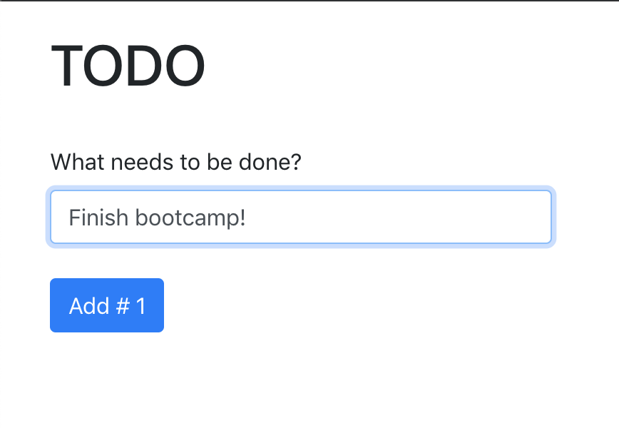

# ReactJS To-Do List

This project was for the Full Stack Developer bootcamp I did and was for a lesson on authentication with ExpressJS apps.

## The Original Assignment

> Create a simple to-do app using React. A user should be able to enter a
number of items that get displayed as a to-do list in your app. The user
should also be able to delete a specific item from the list.

## The Updated Assignment
> * You have previously created a simple to-do app using React where a user could add a number of items that get displayed as a to-do list. The user could also delete a specific item from the list.
> * Modify this task so that a user is required to log in to your application before they can use it. The user should be presented the choice to log in using either Google or by entering a username and password for your app directly (help [here](https://github.com/jaredhanson/passport-local) ).
> * Each users’ to-do list should be saved to a database. When a user logs in they should only be able to see and modify their own to-do list. The user’s to-do list should be preserved between sessions.
> * Create an admin user for your application. When the admin user logs in they should be able to see a list of all the users registered with your app and the to-do lists for each user.

<!-- ## Demo
Update when hosted somewhere -->

## Running the Code Locally

[Clone / Download](https://github.com/dh4u/bootcamp-to-do.git) the project to your computer.

### Start the code
Open command prompt / terminal for the project folder and then you can run:

#### `npm install`

This will install the node dependencies.

#### `npm start`

Runs the app in the development mode. 
Open [http://localhost:3000](http://localhost:3000) to view it in the browser.
 
 

***
###### This project was bootstrapped with [Create React App](https://github.com/facebook/create-react-app).
